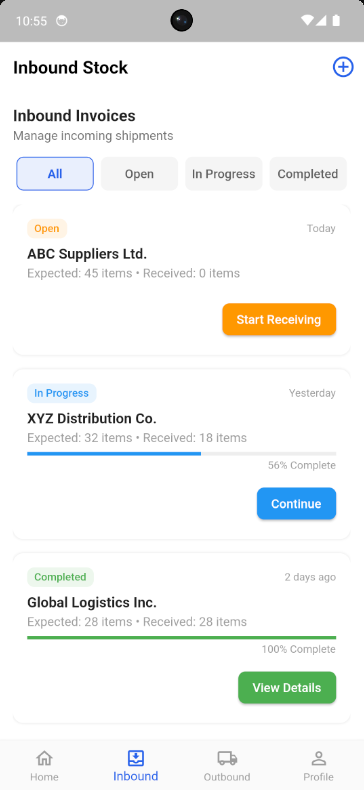
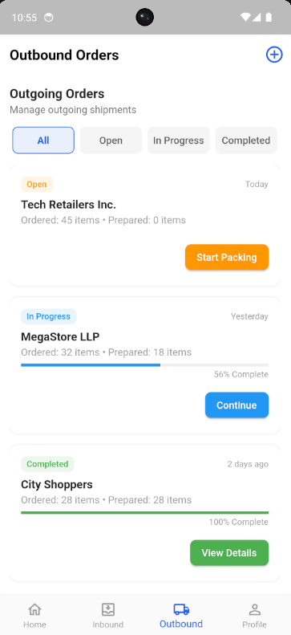
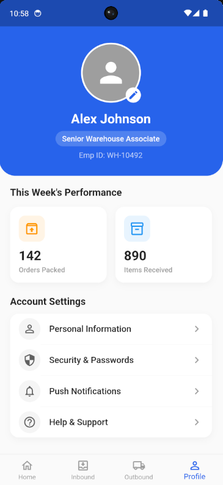
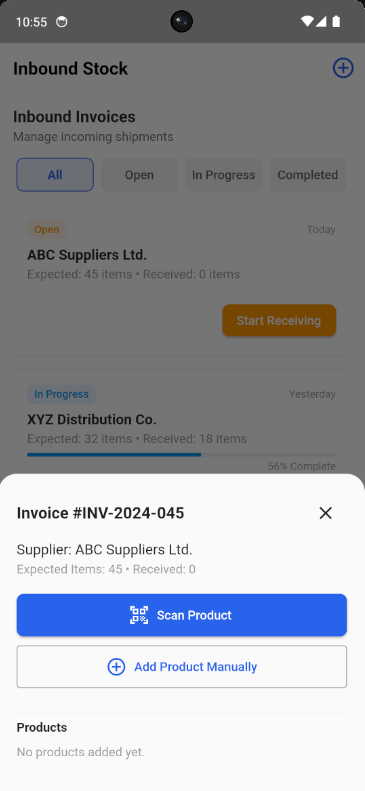

# 📦 Warehouse & Inventory Management App

A comprehensive, high-performance mobile application designed for warehouse logistics, order fulfillment, and inventory tracking. Built natively with **Flutter**, this app streamlines the entire supply chain by providing warehouse employees with premium, fast, and easy-to-use digital tools for their daily shifts.

## ✨ Features

- **🚚 Inbound Logistics (Receiving):** Manage incoming shipments from suppliers, track expected vs. received items, and manually log or verify items upon delivery at the loading dock.
- **📤 Outbound Logistics (Picking & Packing):** A dynamic Outbound Orders interface tracking customer orders by "Open," "In Progress," and "Completed" statuses. Real-time progress bars provide immediate visual feedback for packing workflows.
- **📷 Barcode/QR Scanning Integration:** Utilizes the robust `mobile_scanner` package to validate and autofill product data directly from standard barcodes, reducing manual entry errors drastically.
- **📊 Employee Performance Dashboard:** High-fidelity profile analytics showcasing weekly KPIs like "Orders Packed" and "Items Received," helping management and employees monitor productivity seamlessly.
- **🎨 Premium UI/UX:** Clean, modern, responsive design using customized header bars, dynamic bottom sheets (modals), and color-coded status badges for instant scannability on small screens.

## 📸 Screenshots

<div align="center">
  
  &nbsp;
  
  &nbsp;
  
  &nbsp;
  
</div>

## 🛠️ Technology Stack
- **Framework:** [Flutter](https://flutter.dev/) (Dart) 
- **Design Elements:** Custom `kPrimaryColor` theming, structural `SafeArea` utilization, progress trackers, and detailed `cupertino_icons`
- **Device Capabilities Ext:** `mobile_scanner` for optimized QR/Barcode analysis
- **Architecture:** Modular, component-driven setup mapped logically into `screens/`, `widgets/`, and `utils/` groupings.

## 🚀 Getting Started

### Prerequisites
- [Flutter SDK](https://docs.flutter.dev/get-started/install) (>=3.0.5 <4.0.0)
- Android Studio / VS Code for emulation
- Either a physical iOS/Android device or an emulator configured with camera permissions.

### Installation

1. **Clone the repository:**
   ```bash
   git clone https://github.com/TipXI/Inventory-Management-MobileApp.git
   cd Inventory-Management-MobileApp
   ```
2. **Install dependencies:**
   ```bash
   flutter pub get
   ```
3. **Run the app:**
   ```bash
   flutter run
   ```

## 🎯 Example Workflow
1. User logs in with warehouse employee credentials.
2. Visits the **KPI Dashboard Profile** to check their shift's immediate performance targets.
3. Toggles to **Inbound** to scan and receive a sudden incoming shipment at the docking station.
4. Transitions to **Outbound** directly after to view new "Open" orders and immediately begin picking and packing items for fulfillment dispatch.


## 📄 License
This project is open-source and licensed under the [MIT License](LICENSE).
